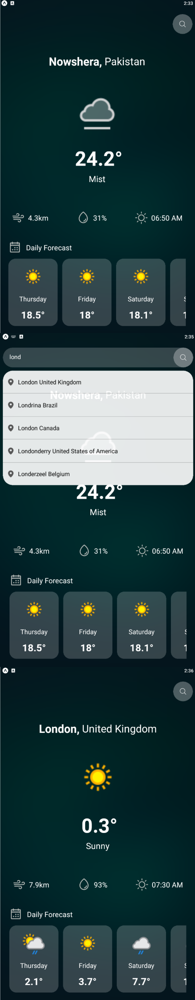

<!-- TABLE OF CONTENTS -->

# 📗 Table of Contents

- [📖 About the Project](#about-project)
  - [🛠 Built With](#built-with)
    - [Tech Stack](#tech-stack)
    - [Key Features](#key-features)
- [👥 Authors](#authors)
- [🤝 Contributing](#contributing)
- [⭐️ Show your support](#support)

<!-- PROJECT DESCRIPTION -->

# 📖 [Weather App] 

### Movie : A comprehensive weather app that keeps you prepared for any weather condition. Get real-time updates, check hourly and 7-day forecasts. With an intuitive design and cross-platform support, it's your perfect companion for staying ahead of the weather! 🌤️🌧️

### Search weather by city or location, access a clean and intuitive interface, and enjoy seamless cross-platform support. It's your ultimate weather companion for daily planning and travel! 🌤️🌧️

## 🛠 Built With 

- React Native Expo - Third-Party API - Axios - AsyncStorage

### Tech Stack 

  <ul>
    <li>React Native Expo</li>
    <li>Third-Party API</li>
    <li>React Navigation</li>
    <li>Axios</li>
    <li>AsyncStorage</li>
  </ul>

<!-- Features -->

### Key Features 

- **[Get Real-Time Weather Updates]**
- **[View Days and Weekly Forecasts]**
- **[Search Weather by City or Location]**
- **[Enjoy a Clean and Intuitive Interface]**
- **[Secure and Cross-Platform Support]**

(<a href="#readme-top">back to top</a>)

<!-- AUTHORS -->

## 👥 Authors 

👤 **Hasnat khan**

- GitHub: [@hasnatali1947](https://github.com/hasnatali1947)
- Twitter: [@hasnatking1947](https://twitter.com/hasnatking1947)
- LinkedIn: [Hasnat ali](https://www.linkedin.com/in/hasnattali/)

(<a href="#readme-top">back to top</a>)

<!-- CONTRIBUTING -->

## 🤝 Contributing 

(<a href="#readme-top">back to top</a>)

<!-- SUPPORT -->

## ⭐️ Show your support 

If you like this project please leave a ⭐️

(<a href="#readme-top">back to top</a>)
